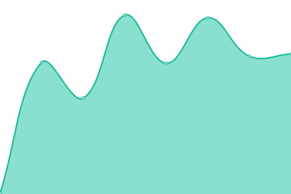
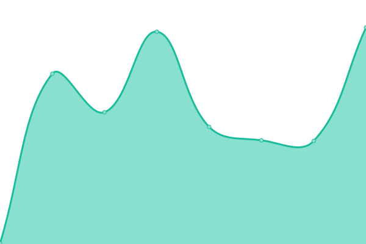
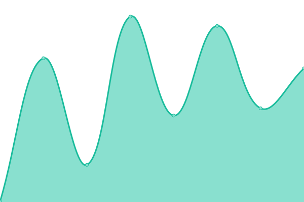

# [📈 Live Status](https://learningtech-org.github.io/upptime): <!--live status--> **🟩 All systems operational**

This repository contains the open-source uptime monitor and status page for [learningtech-org](https://learningtech-org.github.io/upptime), powered by [Upptime](https://github.com/upptime/upptime).

With [Upptime](https://upptime.js.org), you can get your own unlimited and free uptime monitor and status page, powered entirely by a GitHub repository. We use [Issues](https://github.com/learningtech-org/upptime/issues) as incident reports, [Actions](https://github.com/learningtech-org/upptime/actions) as uptime monitors, and [Pages](https://learningtech-org.github.io/upptime) for the status page.

<!--start: status pages-->
<!-- This summary is generated by Upptime (https://github.com/upptime/upptime) -->
<!-- Do not edit this manually, your changes will be overwritten -->
<!-- prettier-ignore -->
| URL | Status | History | Response Time | Uptime |
| --- | ------ | ------- | ------------- | ------ |
|  [learningtech.org](https://learningtech.org) | 🟩 Up | [learningtech-org.yml](https://github.com/learningtech-org/upptime/commits/HEAD/history/learningtech-org.yml) | 

 707ms
     
 | 

<a href="https://learningtech-org.github.io/upptime/history/learningtech-org">99.83%</a>
    

|  [wptest.learningtech.org](https://wptest.learningtech.org) | 🟩 Up | [wptest-learningtech-org.yml](https://github.com/learningtech-org/upptime/commits/HEAD/history/wptest-learningtech-org.yml) | 

 464ms
     
 | 

<a href="https://learningtech-org.github.io/upptime/history/wptest-learningtech-org">100.00%</a>
    

|  [wp.learningtech.org](https://wp.learningtech.org) | 🟩 Up | [wp-learningtech-org.yml](https://github.com/learningtech-org/upptime/commits/HEAD/history/wp-learningtech-org.yml) | 

 863ms
     
 | 

<a href="https://learningtech-org.github.io/upptime/history/wp-learningtech-org">99.83%</a>
    

|  [blogs.learningtech.org](https://blogs.learningtech.org) | 🟩 Up | [blogs-learningtech-org.yml](https://github.com/learningtech-org/upptime/commits/HEAD/history/blogs-learningtech-org.yml) | 

 310ms
     
 | 

<a href="https://learningtech-org.github.io/upptime/history/blogs-learningtech-org">99.14%</a>
    

|  [legacy.learningtech.org](https://legacy.learningtech.org) | 🟩 Up | [legacy-learningtech-org.yml](https://github.com/learningtech-org/upptime/commits/HEAD/history/legacy-learningtech-org.yml) | 

 267ms
     
 | 

<a href="https://learningtech-org.github.io/upptime/history/legacy-learningtech-org">99.83%</a>
    

|  [lhr.learningtech.org](https://lhr.learningtech.org) | 🟩 Up | [lhr-learningtech-org.yml](https://github.com/learningtech-org/upptime/commits/HEAD/history/lhr-learningtech-org.yml) | 

 268ms
     
 | 

<a href="https://learningtech-org.github.io/upptime/history/lhr-learningtech-org">99.83%</a>
    

|  [logo.learningtech.org](https://logo.learningtech.org) | 🟩 Up | [logo-learningtech-org.yml](https://github.com/learningtech-org/upptime/commits/HEAD/history/logo-learningtech-org.yml) | 

 252ms
     
 | 

<a href="https://learningtech-org.github.io/upptime/history/logo-learningtech-org">99.83%</a>
    

|  [students.learningtech.org](https://students.learningtech.org) | 🟩 Up | [students-learningtech-org.yml](https://github.com/learningtech-org/upptime/commits/HEAD/history/students-learningtech-org.yml) | 

 308ms
     
 | 

<a href="https://learningtech-org.github.io/upptime/history/students-learningtech-org">99.30%</a>
    

|  [Google](https://google.com) | 🟩 Up | [google.yml](https://github.com/learningtech-org/upptime/commits/HEAD/history/google.yml) | 

 259ms
     
 | 

<a href="https://learningtech-org.github.io/upptime/history/google">100.00%</a>
    

<!--end: status pages-->

[**Visit our status website →**](https://learningtech-org.github.io/upptime)

## 📄 License

- Powered by: [Upptime](https://github.com/upptime/upptime)
- Code: [MIT](./LICENSE) © [learningtech-org](https://learningtech-org.github.io/upptime)
- Data in the `./history` directory: [Open Database License](https://opendatacommons.org/licenses/odbl/1-0/)
